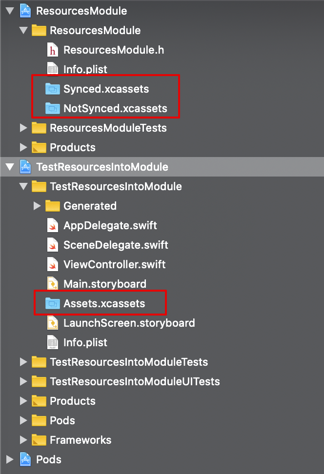
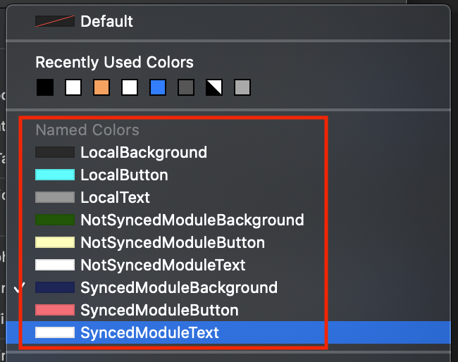
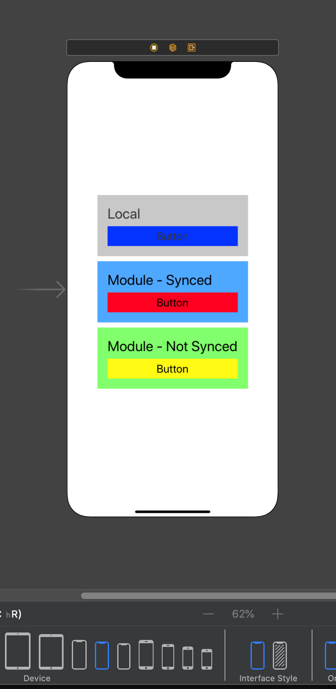
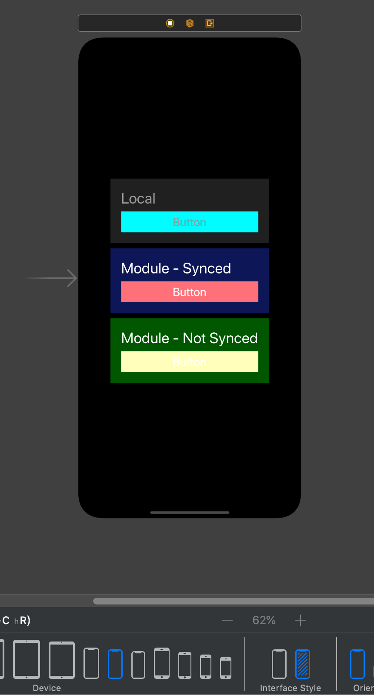
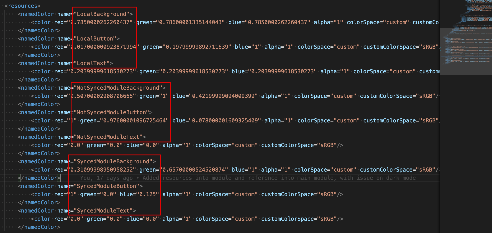
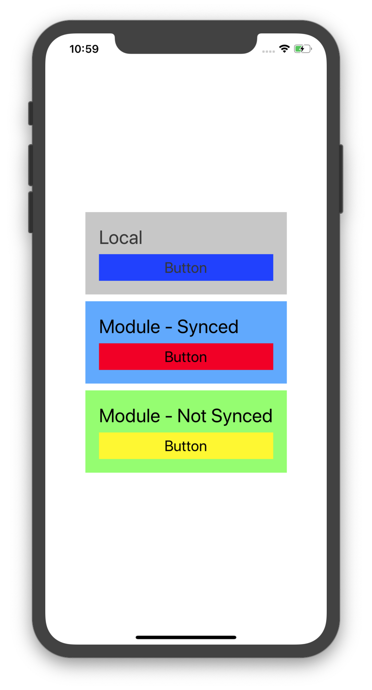
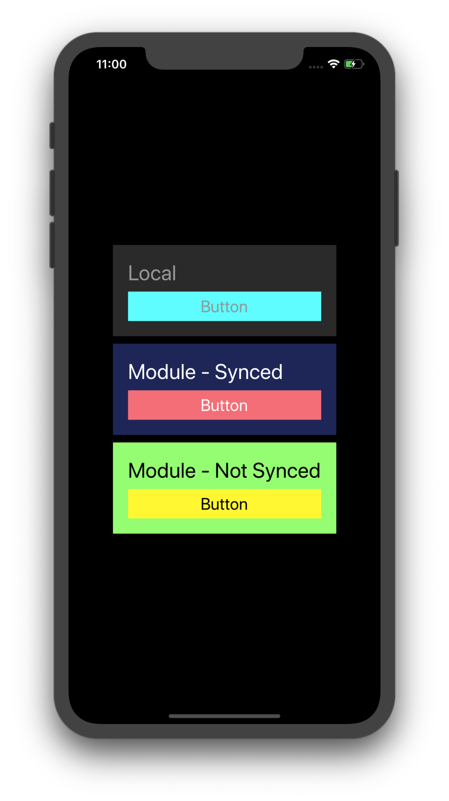

# TestResourcesIntoModule

Demo project to test how Xcode handle resources defined into external module.

The main goal is to create a module (framework) containing the basic UI components to be used into multiple Apps of the same company, but I have some issues with Xcode badly handling Assets (especially Named Colors supporting Dark and Light appearances) coming from external modules when they are used in Storyboards or XIB files. 

As already described in this article: https://devblog.xero.com/managing-ui-colours-with-ios-11-asset-catalogs-16500ba48205, it seems that Xcode doesn't correctly handle named color defined outside the main bundle. 

It seems that also the last version available of Xcode, as today: Version 11.3 (11C29), doesn't correctly handle inside storyboards named colors defined outside the main bundle.

### Project structure

The project is an almost standard configuration, based on a iOS application (TestResourcesIntoModule), a Framework project (ResourcesModule) and a Cocoapods project (Pods), all enclosed into the TestResourcesIntoModule.xcworkspace



* The Assets included into the TestResourcesIntoModule project are working fine.
* The Assets included into the ResourcesModule project are visible into the Main.storyboard of the TestResourcesIntoModule project, but they are not properly handled.
    
    * The storyboard editor correctly show all defined named colors, no matter if they are defined locally or into another module of the workspace.
    * The storyboard preview inside Xcode is working fine, handling both Dark and Light interface styles.
    * The storyboard structure correctly contains as resources tha named colors, but doesn't include any Bundle reference, so I guess that it does the assumption that the colors are all available inside the Main bundle.
    * Running the project into the simulator, the local named colors work fine in both dark and light mode, but colors who are defined inside the ResourcesModule framework cannot be find, so iOS just use fallback color value defined inside the storyboard resources.








### Workaround
At the moment (if the Framework project source code is available locally) it's possible re-declare the Assets (manualy, or with some scripts that does a smart copy) to copy inside the Main bundle project the assets where the named colors are defined. For example using an rsync script like that:

```bash
rsync -azvh --delete ResourcesModule/ResourcesModule/Synced.xcassets TestResourcesIntoModule/Generated/
```

Another option would be to import the UI module as a git submodule into the main project, so that technically the Assets are declared and included into the main module and Xcode doesn't do any strange behaviour.

